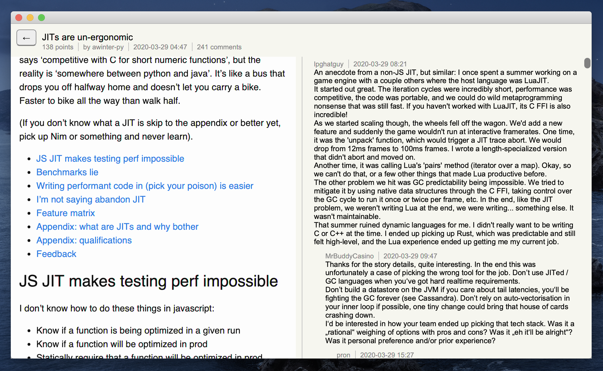

# Cljfx-based Hacker News reader app

This is an example of a desktop application that can be built on top of cljfx/java stack. 
It uses:
- [cljfx](https://github.com/cljfx/cljfx) for UI and behavior;
- [cljfx/css](https://github.com/cljfx/css) for styling;
- [jpackage](https://openjdk.java.net/jeps/343) for packaging.

You can download the latest release [here](https://github.com/cljfx/hn/releases).

## Context

Previously packaging java-based apps for distribution was
one of the pain points compared to web: one had to strip down the JDK and figure
out how to pack it with uberjar for every platform themselves. JDK 14 introduces a new 
tool called `jpackage` (part of JDK distribution) that does all this work. Now the year 
of Clojure on the desktop is finally right around the corner, all you need is this small 
example to get started.

## Walk-through

The code is pretty simple: [hn.core](src/hn/core.clj) is a main namespace that starts
an app in its `-main` function. Note that it uses `(Platform/setImplicitExit true)` so
closing the window will stop JavaFX application thread. This, together with custom daemon 
executor for agents, will allow to gracefully exit the app just by closing the app 
window.

The build process is 2-step:
1. Assemble an uberjar. Here it's done using Sean Corfield's 
[depstar](https://github.com/seancorfield/depstar) library with `clj -A:uberjar` alias.
2. Use `jpackage` with common options described in [jpackage/common](jpackage/common) and 
platform-specific options having their own files: [jpackage/linux](jpackage/linux), 
[jpackage/mac](jpackage/mac) and [jpackage/windows](jpackage/windows). For example, if you 
are on Linux, you just need to execute `jpackage @jpackage/common @jpackage/linux`. 

Cross-compiling is not supported by jpackage, so you will need access to all 3 OSes to 
assemble desktop packages. This repo has an example of github actions to create all 
3 desktop packages: [.github/workflows/build-release-artifacts.yml](.github/workflows/build-release-artifacts.yml).
Also note that JavaFX has platform-specific native libraries for every platform, which 
means uberjar needs to be assembled separately for every platform.
